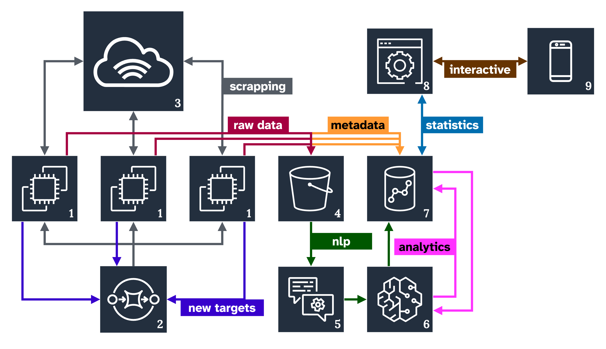
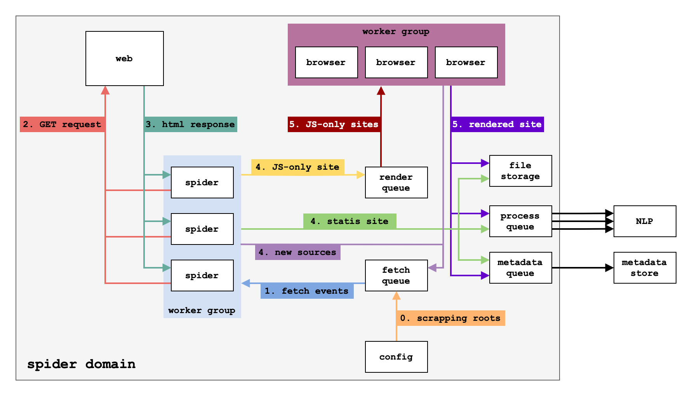

# De Bias

<div align = center><br><br>

&ensp;[<kbd> <br> Overview <br> </kbd>](#overview)&ensp;
&ensp;[<kbd> <br> Technologies <br> </kbd>](#technologies)&ensp;
&ensp;[<kbd> <br> Deploy <br> </kbd>](#deploy)&ensp;
&ensp;[<kbd> <br> EDA <br> </kbd>](#eda)&ensp;
&ensp;[<kbd> <br> Current state <br> </kbd>](#current-state)&ensp;
<br><br><br><br></div>

## Table of Contents
- [De Bias](#de-bias)
  - [Table of Contents](#table-of-contents)
  - [Overview](#overview)
  - [Technologies](#technologies)
  - [Services](#services)
    - [Scraper](#scraper)
    - [Renderer](#renderer)
    - [Processor](#processor)
    - [Server](#server)
    - [Metastore](#metastore)
    - [S3](#s3)
    - [Wordstore](#wordstore)
    - [Message queue](#message-queue)
  - [Deploy](#deploy)
    - [Using external S3 provider](#using-external-s3-provider)
    - [Using local S3 provider](#using-local-s3-provider)
    - [Scale services for better performance!](#scale-services-for-better-performance)
    - [Remove services](#remove-services)
  - [Development](#development)
    - [Structure](#structure)
    - [Adding new service](#adding-new-service)
  - [EDA](#eda)
    - [Distribution of political positions overall](#distribution-of-political-positions-overall)
    - [Distribution of political positions in the USA](#distribution-of-political-positions-in-the-usa)
    - [Distribution of political positions in the UK](#distribution-of-political-positions-in-the-uk)
    - [Bonus: Distribution of political positions of sources which require VPN](#bonus-distribution-of-political-positions-of-sources-which-require-vpn)
  - [Current state](#current-state)


## Overview

The repository is dedicated to the Debias project, dedicated to showing relationships between different concepts in the news. 

We cover different geographical locations (mainly USA and UK), different political positions (taken from [AllSides](https://www.allsides.com/unbiased-balanced-news)) and various news providers.

The final goal is to create an interactive visualization, which would show how concepts are interconnected within different time stamps and from different points of view.



## Technologies

- </img> Python
- </img> Docker
- </img> Redis 
- </img> MinIO
- </img> NATS
- </img> Postgres 
- </img> Playwright

## Services



### [Scraper](debias/scraper/readme.md)
Scaper is a service which scrapers news from different news providers. This service is recursively calling itself to scrape the next news pages.
If page requires rendering, it will be sent to the `renderer` service. If page is static, it is stored in the `s3` service, metadata is stored in the `metastore` service, and a `processor` service is called to process the page.

### [Renderer](debias/renderer/readme.md)
Renderer is a service which renders news pages using browser API. It is called by the `scraper` service. After render, it saves HTML content to the `s3` service and metadata to the `metastore` service and sends a request to the `processor` service to process the page.

### [Processor](debias/processor/readme.md)
Processor is a service which processes news pages. It extracts human-readable text from the page, performs NLP pipelines and stores the results in the `wordstore` service.

### [Server](debias/server/readme.md)
Web server which serves the results of the `processor`. It aggregates the statistics of the words, precomputes and caches aggregations, and serves them to the client. It serves the frontend files as well.

### Metastore
A postgres database which stores metadata of the scraped pages.

### S3
A S3 provider which stores the static pages. Could be a local MinIO deployment or an external S3 cloud service.

### Wordstore
A postgres database which stores the words of the processed pages.

### Message queue
A NATS message queue which is used for S2S communication.


## Deploy

The initial version is available at https://data-wrangling-and-visualisation.github.io/DeBias/
The EDA is available at https://data-wrangling-and-visualisation.github.io/DeBias/
The draft Javascript visualization is available at https://debias.inno.dartt0n.ru/

### Using external S3 provider

0. Create `.env` file
Fill in the following variables:
```bash
PG_USERNAME=...
PG_PASSWORD=...
```

1. Create `debias/scraper/config.toml`

> [!NOTE]
> You can find example configuration in [`debias/scraper/example.config.toml`](debias/scraper/example.config.toml)

2. Run services

```bash
docker compose -f docker-compose.yml up --build --detach
```

### Using local S3 provider

0. Create `.env` file
Fill in the following variables:
```bash
MINIO_ACCESS_KEY=...
MINIO_SECRET_KEY=...
MINIO_BUCKET=...
```

1. Create MinIO S3 service using docker:
```bash
docker compose -f minio.docker-compose.yml up minio_setup
```

2. Create `debias/scraper/config.toml`

> [!NOTE]
> You can find example configuration in [`debias/scraper/example.config.toml`](debias/scraper/example.config.toml)

3. Run services

```bash
docker compose -f minio.docker-compose.yml up --build --detach
```

### Scale services for better performance!

The following services could be automatically scaled horizontally for better performance:
- scaper
- renderer
- processor

For easy scaling use docker-compose `--scale` option.

E.g., the following command will launch 5 `scaper instances, 2 `renderer` instances. 2 `processor` instances:
```bash
docker compose up --detach \
  --scale scaper=5 \
  --scale renderer=2 \
  --scale processor=2\
```

### Remove services

To stop all remove all containers AND THEIR VOLUMES:
```bash
docker compose -f minio.docker-compose.yml down --volumes
# or
docker compose -f docker-compose.yml down --volumes
```

## Development

### Structure
```
.
├── debias       # shared code root
│   ├── core     # reusable components - s3, metastore, configs, etc
│   └── scraper   # scraper related code
```

### Adding new service
To add new service:
1. Create new directory in `debias` directory
2. Create `dockerfile` prefixed with `servicename` (e.g. `scraper.dockerfile`)
3. Add all the required dependencies to `pyproject.toml` under `--group servicename`


## EDA

We have collected 38 sources of news from USA and UK and found out their political positions.

### Distribution of political positions overall
</img>

### Distribution of political positions in the USA
</img>

### Distribution of political positions in the UK
</img>

### Bonus: Distribution of political positions of sources which require VPN
</img>

It seems left parties are indeed more liberal.

We have parsed several news articles using python and prepared a deployment describing general trends in these articles.

The deployment can be found on [Github Pages](https://data-wrangling-and-visualisation.github.io/DeBias/)


## Current state

We have added a draft of our frontend visualization. It can be viewed in the **frontend** directory, in the **index.html** file. 

For now we have not created connection with the backend, however the file respresent our vision of the final visualization: graph of connections between keywords, their corresponding themes and number of occurence.

The file can be opened as an html file, or py running the following script from the **frontend** directory:

```python
python3 -m http.server
```

We are also incorporating NLP into data analysis. We perform the following operations on the extracted websites data:

- Extract names entities from text: helps identify the most important keywords (people's names, countries, organizations). Performed with spacy.
- Find themes in the data: identify general theme of the text (politics, economics, etc.). Performed with transformers.

The collected keywords are then combined for future analysis.

Example of NLP preprocessing can be found in **debias/processor directory**, in **processor.py** file.

Deploy can be found at: https://debias.inno.dartt0n.ru/

We have added the functionality to filter by date, category, number of keyword occurences. The number of shown nodes can also be limited.
