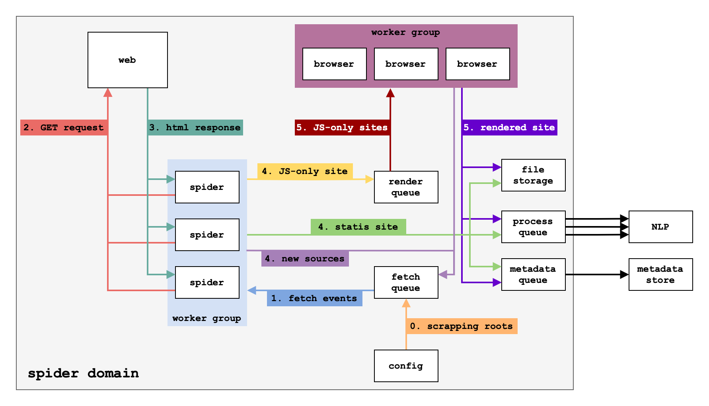

# De Bias - Scaper

## Architecture


## Prerequisites

- [uv](https://github.com/astral-sh/uv)
- [nats](https://github.com/nats-io/nats-server)

## Development

1. Create `config.toml` file in the `debias/scaper` directory

2. Install dependencies:
```bash
uv sync --group scaper
```

3. Launch application with hot reload:
```bash
uv run faststream run debias.scaper:app --config=/app/config.toml --workers 1
```
